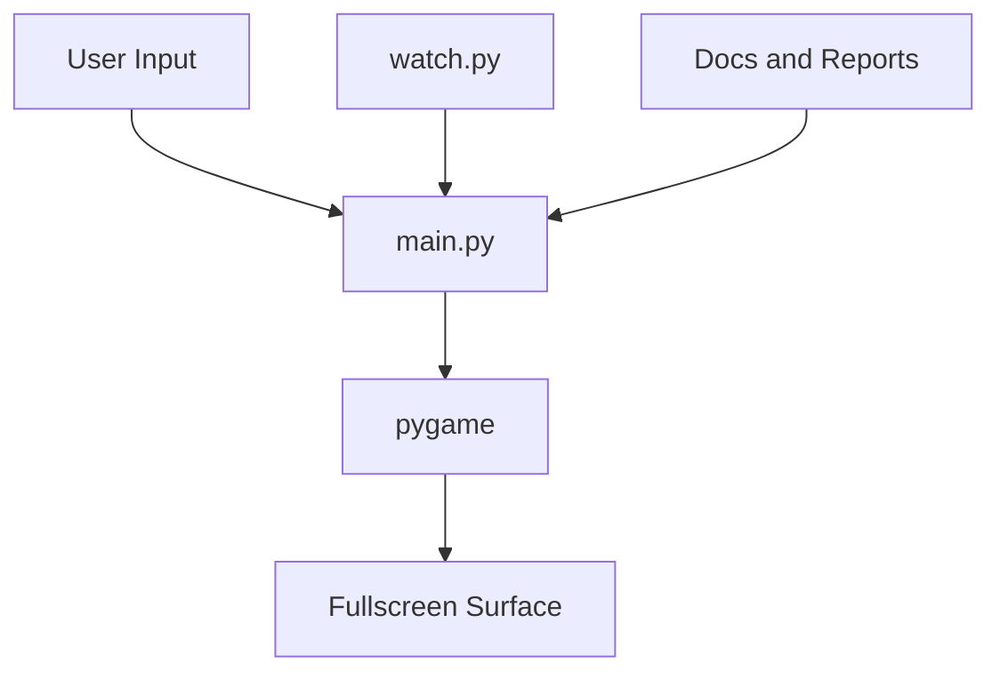
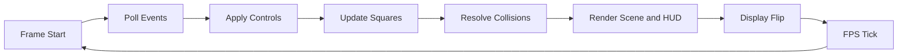
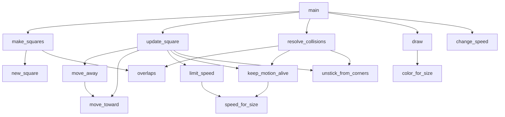
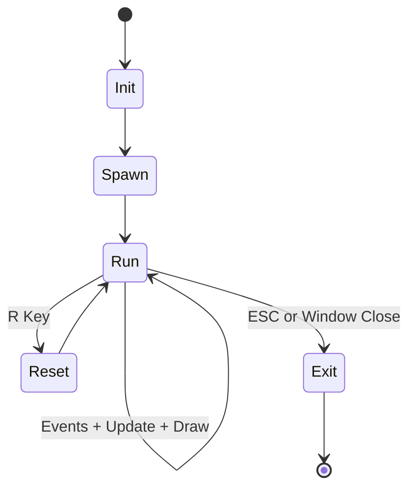

# Lab8 Pygame Architecture

This architecture document was regenerated from the current repository state on 04-27-2026. The project is a compact Pygame simulation where larger squares chase smaller squares, smaller squares flee larger ones, and all entities keep a random wander component.

## 1. Project Inventory

- `main.py`: Entry point, event loop, simulation update, collision resolution, and rendering.
- `watch.py`: Development restart loop that relaunches `main.py` when `*.py` files change.
- `requirements.txt`: Python dependency list.
- `README.md`: Usage and controls.
- `REPORT.md`: Reflection and process summary.
- `JOURNAL.md`: Turn-by-turn interaction log.
- `docs/`: Generated architecture documentation.

Assumptions:
- The repository currently uses script-level architecture rather than package-level modularization.
- There is no automated test suite in the current tree.

## 2. Diagrams

### 2.1 High-Level Module Map

This diagram shows that runtime behavior is concentrated in `main.py`, with `watch.py` acting as a development helper and docs acting as supporting artifacts.

### 2.2 Frame Pipeline (Runtime Data Flow)

The game loop is deterministic in ordering and stochastic in movement values, which balances readability with lively motion.

### 2.3 Key Function Dependency Graph

The dependency center of gravity is `update_square` plus `resolve_collisions`, while `main` remains the orchestrator of sequencing.

### 2.4 Execution Lifecycle

Lifecycle is minimal and explicit, which helps first-year students trace behavior quickly.

## 3. Risks, Coupling, Improvement Opportunities

- `main.py` combines state, behavior, input, and rendering in one unit, creating tight coupling.
- Square state is represented by dictionaries, which reduces type safety.
- Collision handling uses pairwise checks O(n^2), suitable for small N but not scalable.
- Randomness is not seeded, limiting exact reproducibility.
- Fullscreen startup can be inconvenient in some teaching or recording setups.

Potential improvements:
- Introduce a `Square` dataclass.
- Split into modules such as `simulation.py`, `render.py`, and `input.py`.
- Add optional deterministic seed parameter for debug runs.
- Add unit tests for pure helpers (`overlaps`, `speed_for_size`, `change_speed`).

## 4. Quick Onboarding Checklist

1. Create and activate a virtual environment.
2. Install dependencies with `python -m pip install -r requirements.txt`.
3. Start the app with `python main.py`.
4. Use Up/Down or +/- for speed, R to reset, Esc to quit.
5. Use `python watch.py` for auto-restart during editing.
6. Review this document before major refactors.
